# 環境構築

## git
https://git-scm.com/

### 設定
```
# 改行コードの自動変換を行わない
git config --global core.autocrlf false
```
## Python
### pyenvインストール
複数のバージョンを管理できるように「pyenv」をインストールする

https://github.com/pyenv-win/pyenv-win

PowerShellを起動して、以下のコマンドを入力。(公式の方法に従う)
```
git clone https://github.com/pyenv-win/pyenv-win.git "$HOME/.pyenv"
[System.Environment]::SetEnvironmentVariable('PYENV',$env:USERPROFILE + "\.pyenv\pyenv-win\","User")
[System.Environment]::SetEnvironmentVariable('PYENV_ROOT',$env:USERPROFILE + "\.pyenv\pyenv-win\","User")
[System.Environment]::SetEnvironmentVariable('PYENV_HOME',$env:USERPROFILE + "\.pyenv\pyenv-win\","User")
[System.Environment]::SetEnvironmentVariable('path', $env:USERPROFILE + "\.pyenv\pyenv-win\bin;" + $env:USERPROFILE + "\.pyenv\pyenv-win\shims;" + [System.Environment]::GetEnvironmentVariable('path', "User"),"User")
```

### Pythonインストール
```
# PowerShellを再起動する
# バージョンが表示されることを確認
pyenv --version
# lambdaで「Python3.9」を使用する場合
pyenv install 3.9.5
pyenv global 3.9.5
```

## AWS SAM + Docker
### インストール
https://docs.aws.amazon.com/ja_jp/serverless-application-model/latest/developerguide/serverless-getting-started.html

## PyCharm
### インストール
Communityをインストールする

https://www.jetbrains.com/ja-jp/pycharm/

### Pycharm設定
- Pluginインストール
  - AWS Toolkit
  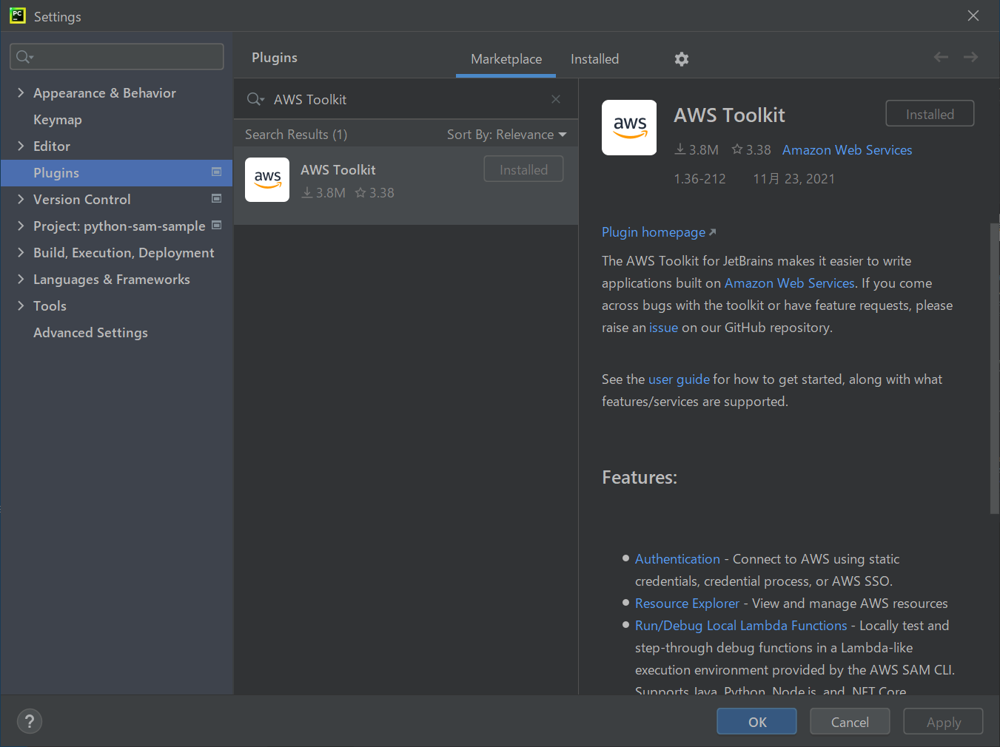
  - File Watchers(保存時にアクションを実行できる)
  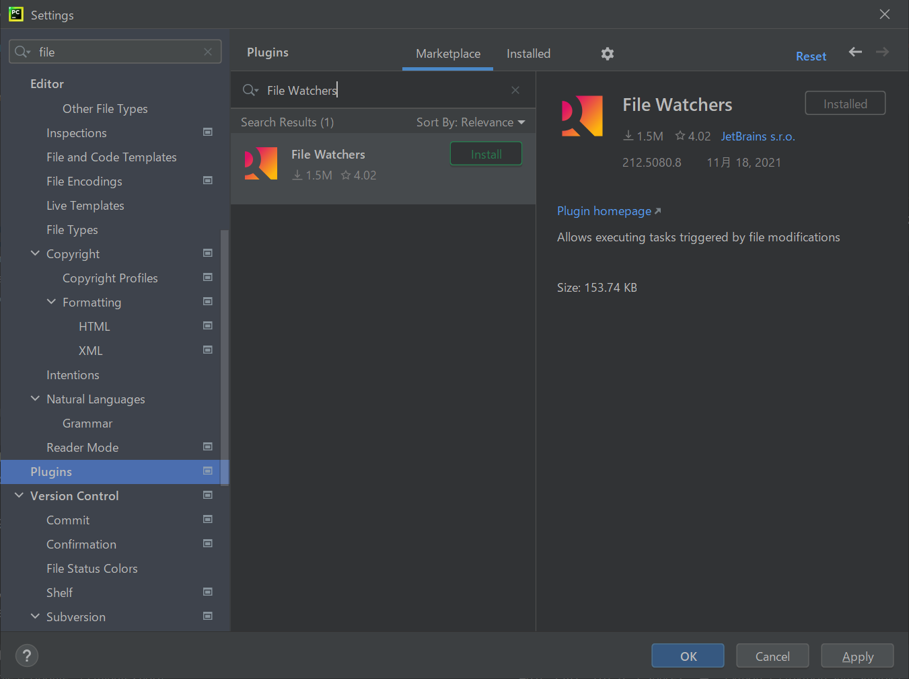

- PyCharm設定
  - 設定画面の表示
  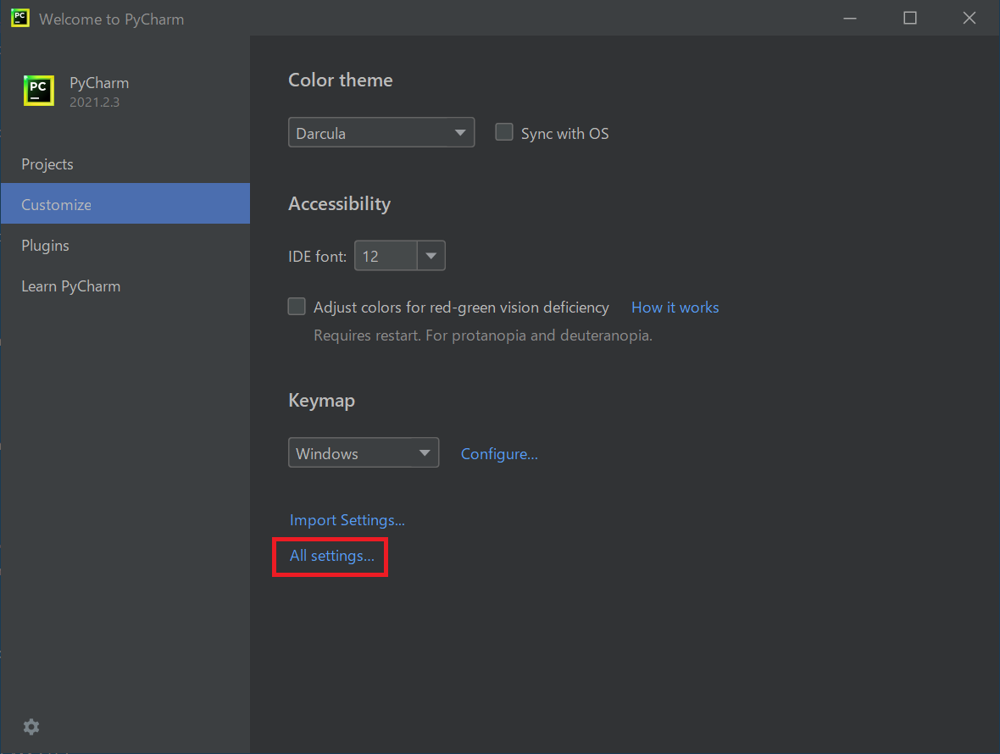

  - 改行コードをLF(\n)にする
  

  - Commitメッセージのクリア
  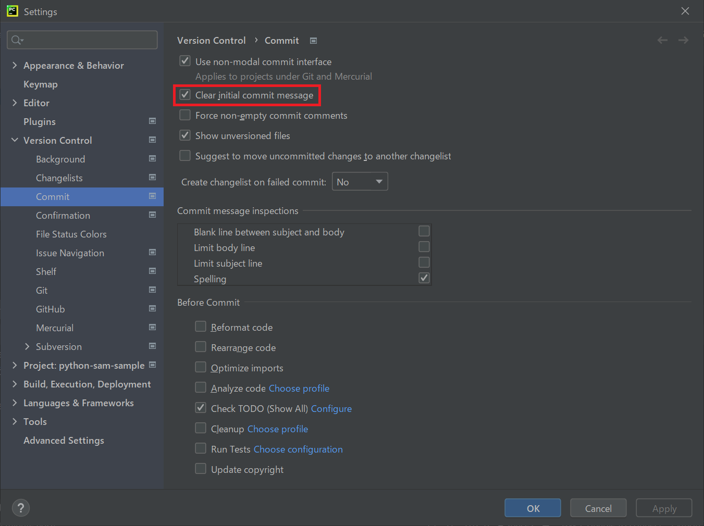

  - Welcome画面の表示(任意)
  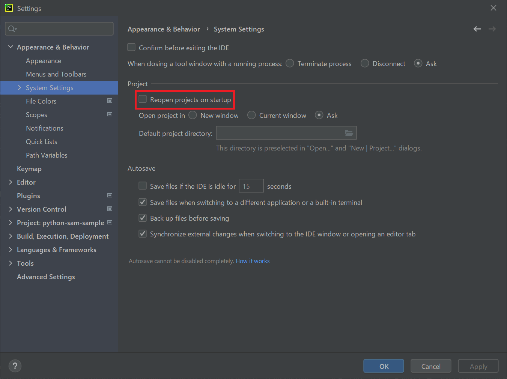

# 開発開始時
## プロジェクト作成
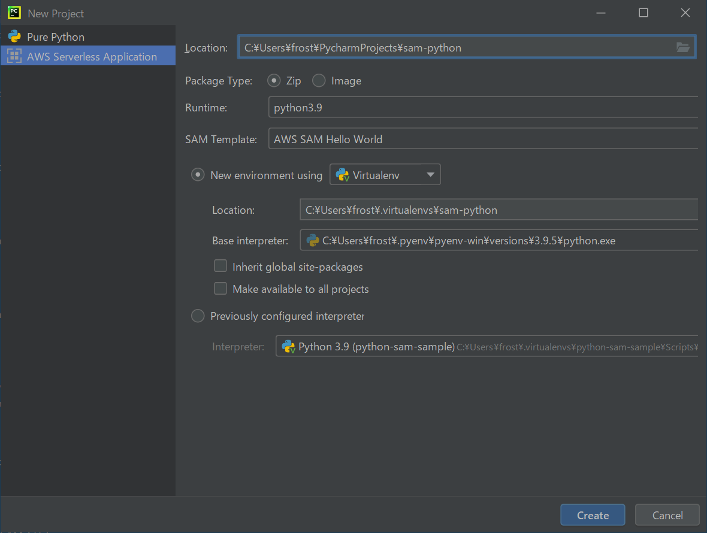

## 改行コード設定
- 改行コード確認
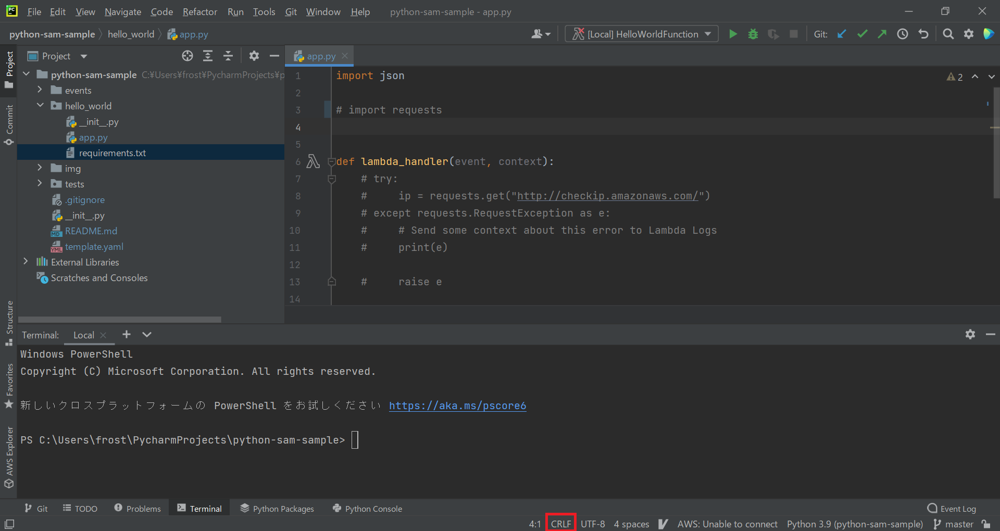

- 改行コード一括変更
  - プロジェクトの親ディレクトリを選択
  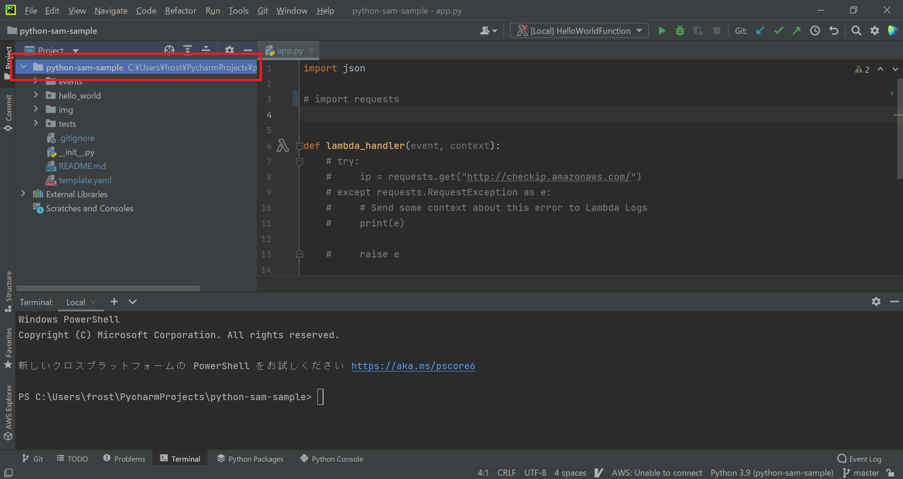

  - 改行コード変更
  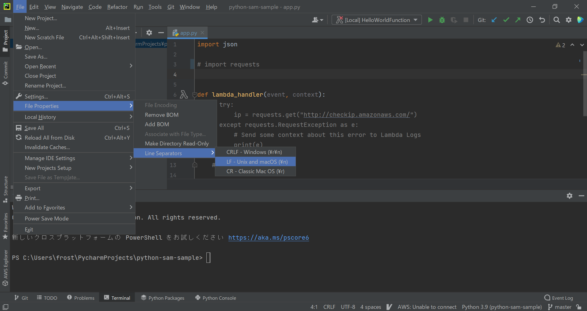

## Formatter設定
- black

https://black.readthedocs.io/en/stable/integrations/editors.html

## PreCommit設定
1. インストール
```
pip install pre-commit
```
2. .pre-commit-config.yaml作成
```
repos:
  # formatter
  - repo: https://github.com/psf/black
    rev: 21.12b0
    hooks:
      - id: black
  - repo: https://github.com/pycqa/isort
    rev: 5.10.1
    hooks:
      - id: isort
  # linter
  - repo: https://github.com/pycqa/flake8
    rev: 4.0.1
    hooks:
      - id: flake8
```
3. git hook script に登録
```
pre-commit install
```

## パッケージインストール

## メンバー参加時
1. 開発環境構築を行う
2. Get From VCSをクリック
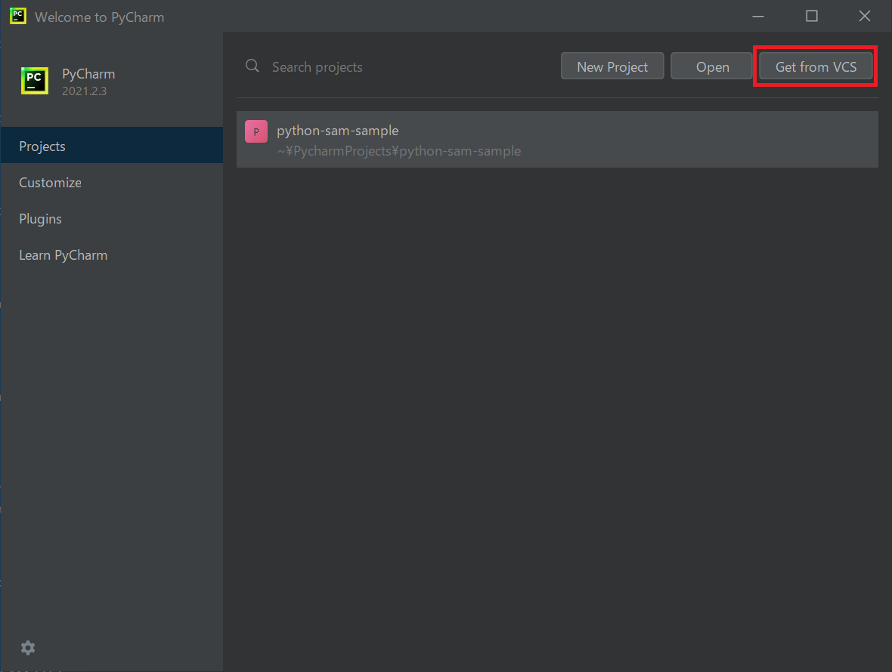
3. Githubの情報を入力する
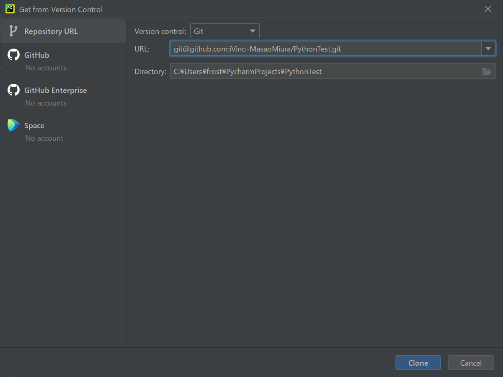
4. venv設定を行う
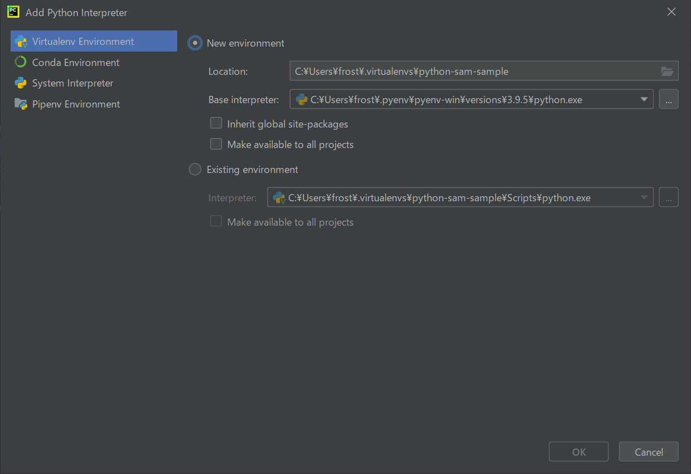
5. Formatter設定を行う
- black
https://black.readthedocs.io/en/stable/integrations/editors.html
6. PreCommit設定を行う
```
pre-commit install
```
