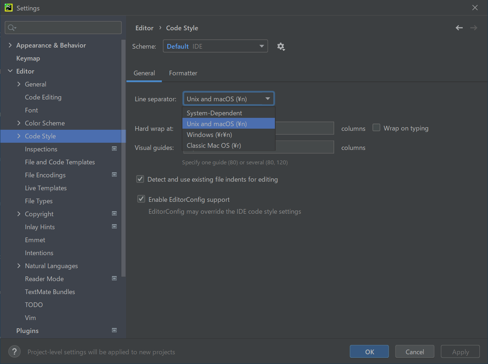

# 環境構築

##git
https://git-scm.com/

###設定
```
# 改行コードの自動変換を行わない
git config --global core.autocrlf false
```
##Python
###pyenvインストール
複数のバージョンを管理できるように「pyenv」をインストールする

https://github.com/pyenv-win/pyenv-win

PowerShellを起動して、以下のコマンドを入力。(公式の方法に従う)
```
git clone https://github.com/pyenv-win/pyenv-win.git "$HOME/.pyenv"
[System.Environment]::SetEnvironmentVariable('PYENV',$env:USERPROFILE + "\.pyenv\pyenv-win\","User")
[System.Environment]::SetEnvironmentVariable('PYENV_ROOT',$env:USERPROFILE + "\.pyenv\pyenv-win\","User")
[System.Environment]::SetEnvironmentVariable('PYENV_HOME',$env:USERPROFILE + "\.pyenv\pyenv-win\","User")
[System.Environment]::SetEnvironmentVariable('path', $env:USERPROFILE + "\.pyenv\pyenv-win\bin;" + $env:USERPROFILE + "\.pyenv\pyenv-win\shims;" + [System.Environment]::GetEnvironmentVariable('path', "User"),"User")
```

PowerShellを再起動し、`pyenv --version`でバージョンが表示されることを確認
###Pythonインストール
```
# lambdaで「Python3.9」を使用する場合
pyenv install 3.9.5
```

## AWS SAM + Docker
###インストール
https://docs.aws.amazon.com/ja_jp/serverless-application-model/latest/developerguide/serverless-getting-started.html

##PyCharm
###インストール
Communityをインストールする

https://www.jetbrains.com/ja-jp/pycharm/

###設定
- Pluginインストール
  - AWS Toolkit
  

- Pycharm設定
  - 設定画面の表示
  

  - 改行コードをLF(\n)にする
  

  - Welcome画面の表示(任意)
  

###プロジェクト作成


###Git Clone

